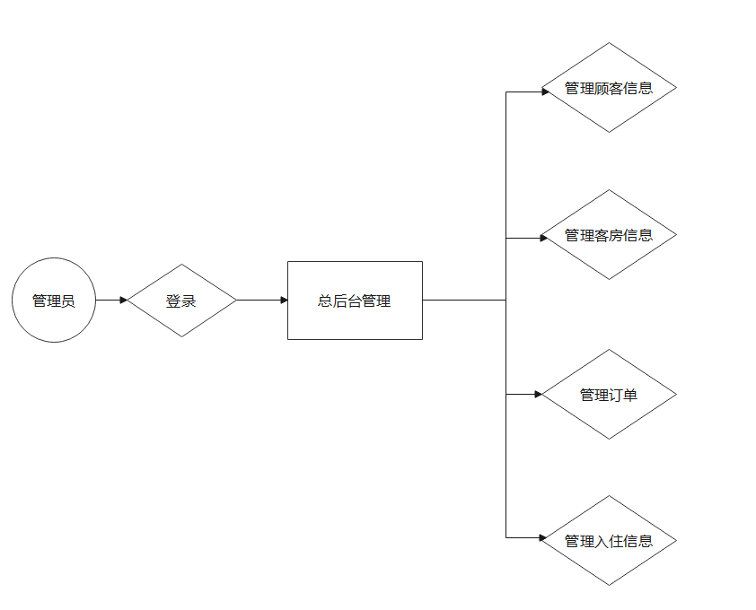
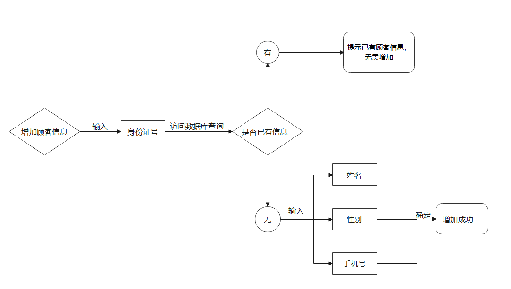
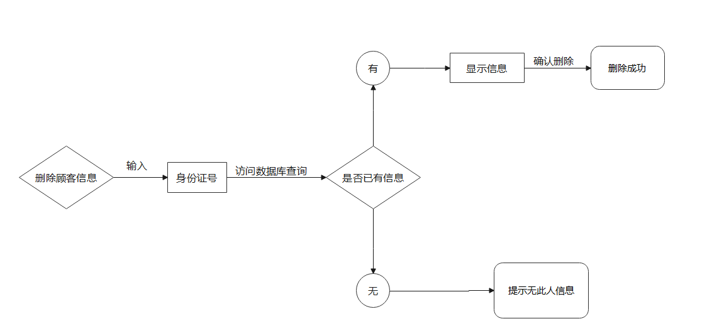
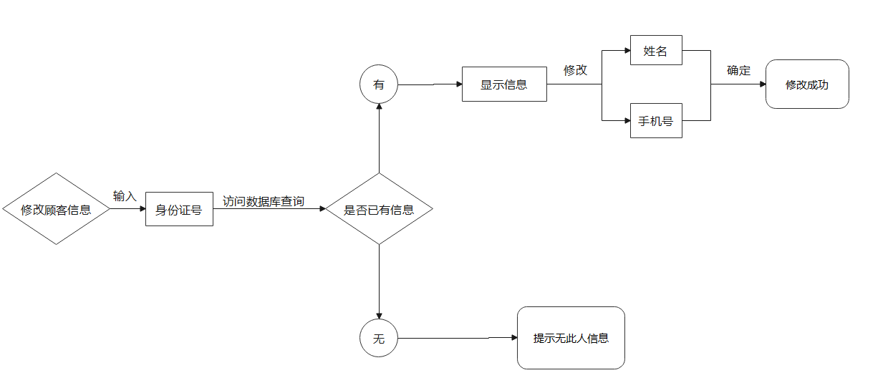
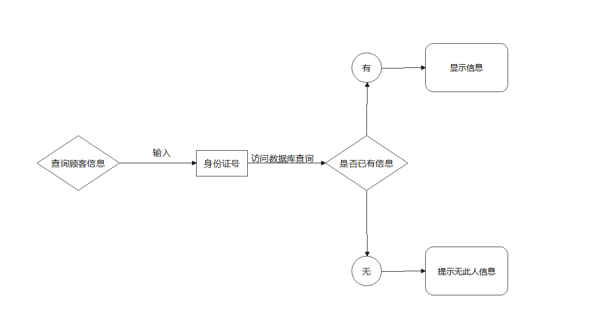
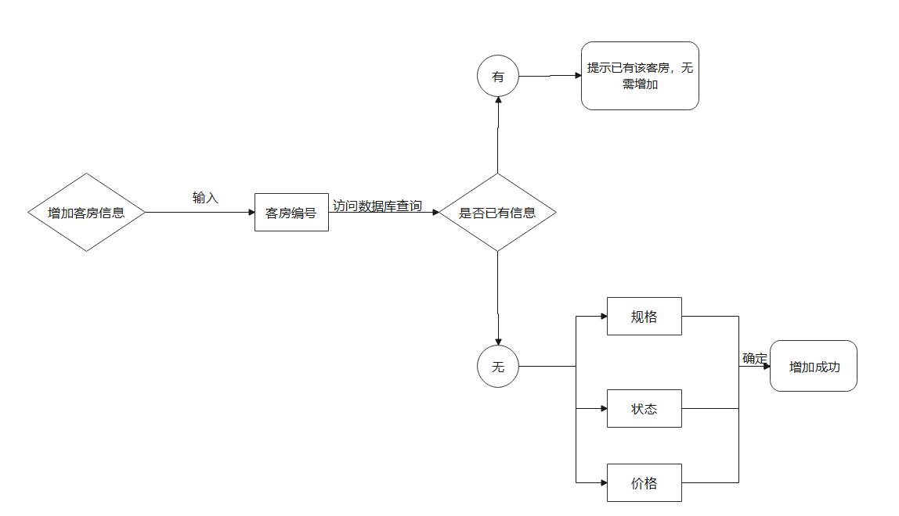
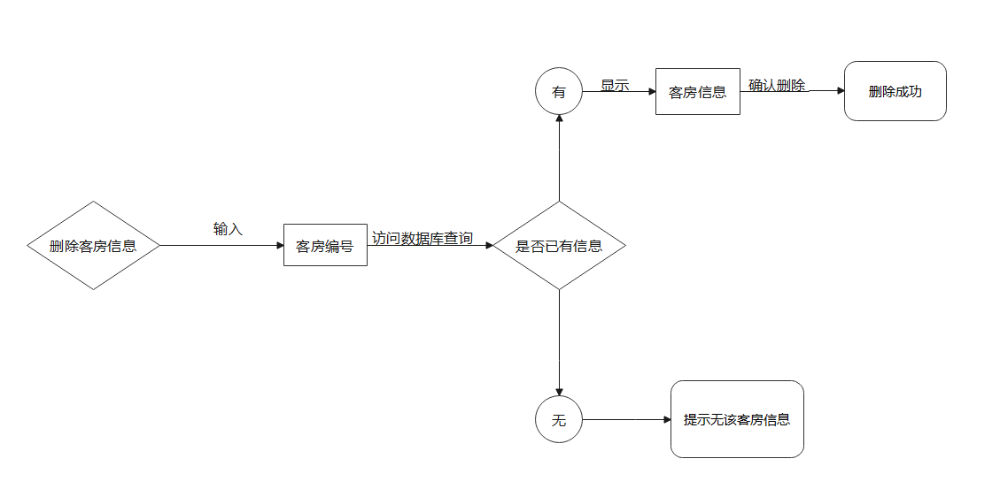
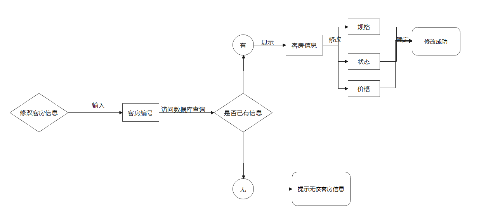
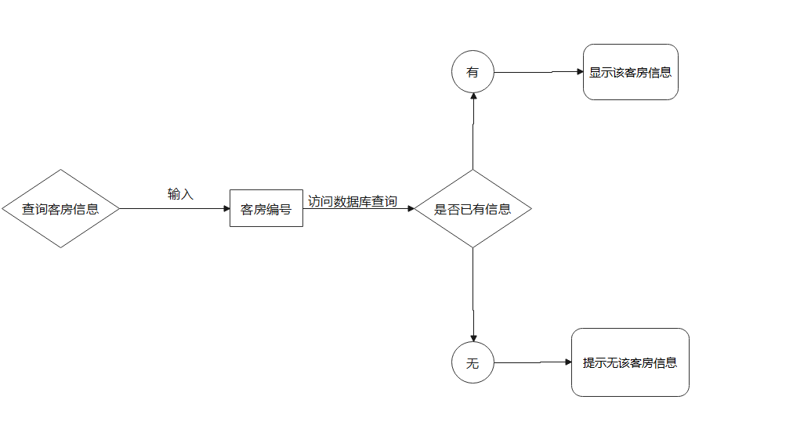
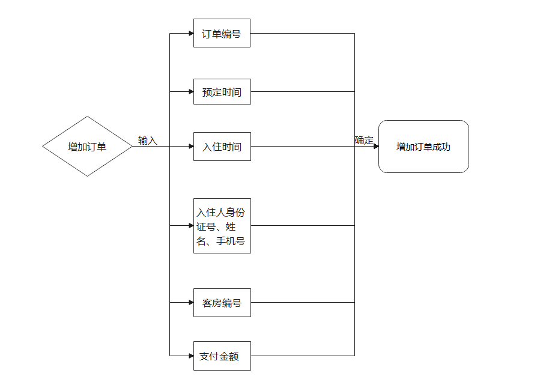

# 1 需求分析

### 1.1 角色

本酒店管理系统应用于酒店前台，角色为管理员，即前台。

### 1.2 业务流程图



### 1.3 功能流程图

##### 1.3.1 管理顾客信息

###### 1. 增加顾客信息

顾客在发出订房请求时，首先录入该顾客信息，供后续增加订单使用。



###### 2. 删除顾客信息



###### 3. 修改顾客信息



###### 4. 查询顾客信息



##### 1.3.2 管理客房信息

###### 1. 增加客房信息



###### 2. 删除客房信息



###### 3.修改客房信息



###### 4.查询客房信息




##### 1.3.3 管理订单

###### 1. 增加订单

一个订单对应一间客房。顾客支付后即增加订单。

订单编号自动生成；预定时间为支付时间；入住时间为顾客拟入住时间；入住人信息通过输入身份证号从数据库导入（可有多个入住人）；客房编号通过查询空闲的指定房型客房进行选择；支付金额为顾客支付的总金额。



###### 2. 删除订单

通过输入订单编号/客房编号，查询订单，确认并删除。

###### 3. 修改订单

通过输入订单编号/客房编号，查询订单，修改指定信息。

###### 4. 查询订单

通过输入订单编号/客房编号，查询订单。

##### 1.3.4 管理入住信息

###### 1. 增加入住信息

一个入住信息对应一间客房。生成订单后，顾客入住时，增加入住信息。

入住信息编号自动生成；客房编号、入住人信息、入住日期与订单中信息保持一致；离店日期初始为空，待客户退房时填入；状态分为入住中、续住、已退房，初始为入住中。


###### 2. 修改入住信息

通过输入入住信息编号/客房编号，查询入住信息，修改指定信息。

###### 3. 查询入住信息

通过输入入住信息编号/客房编号，查询入住信息。


# 2 数据库设计

### 2.1 表设计

##### 1. Customer

顾客信息表（身份证号、姓名、性别、手机号、打折信息）

| 属性       | 数据类型    | 非空   | 主键 | 备注    |
| ---------- | ----------- | ------ | ---- | ------- |
| customerId | VARCHAR(30) | Y      | Y    |         |
| name       | VARCHAR(30) | Y      |      |         |
| sex        | CHAR(1)     | Y      |      | F，M    |
| phoneNum   | int         | Y      |      |         |
| discount   | int         | 默认10 |      | eg：8折 |

##### 2. Room

客房信息表（客房编号、规格、状态、价格）

| 属性   | 数据类型    | 非空 | 主键 | 备注                 |
| ------ | ----------- | ---- | ---- | -------------------- |
| roomId | VARCHAR(30) | Y    | Y    |                      |
| size   | VARCHAR(30) | Y    |      | 单人间/双人间/豪华间 |
| state  | VARCHAR(30) | Y    |      | 维修/入住/空闲       |
| price  | int         | Y    |      | 原价                 |

##### 3. Order

订单信息表（订单编号、客房编号、预定时间、拟入住时间、入住人身份证号、支付金额）

| 属性        | 数据类型    | 非空 | 主键 | 备注                 |
| ----------- | ----------- | ---- | ---- | -------------------- |
| orderId     | VARCHAR(30) | Y    | Y    |                      |
| roomId      | VARCHAR(30) | Y    |      | 外键，参照Room表     |
| reserveDate | TimeStamp   | Y    |      | 生成订单的时间       |
| checkinDate | TimeStamp   | Y    |      | 拟入住时间           |
| customerId  | VARCHAR(30) | Y    |      | 外键，参照Customer表 |
| price       | Number(6,2) | Y    |      |                      |

##### 4. Checkin

入住信息表（入住信息编号、客房编号、入住人身份证号、入住日期、离店日期、状态）

| 属性        | 数据类型    | 非空     | 主键 | 备注                                           |
| ----------- | ----------- | -------- | ---- | ---------------------------------------------- |
| checkinId   | VARCHAR(30) | Y        |      | （一起开房的人此字段相同）格式：yyyy-MM-dd-num |
| roomId      | VARCHAR(30) | Y        |      | 外键，参照Room表                               |
| customerId  | VARCHAR(30) | Y        |      | 外键，参照Customer表                           |
| checkinDate | TimeStamp   | Y        |      | 真实入住时间                                   |
| leaveDate   | TimeStamp   |          |      | 真实退房时间                                   |
| state       | VARCHAR(30) | Y        |      | 入住中/续住/已退房                             |
| number      | int         | 默认1    |      | 入住人数                                       |
| UUID        | int         | auto_inc | Y    | 只是主键，没有意义                             |

##### 5. Admin

前台管理员（身份证号、姓名、性别、手机号、打折信息）

| 属性       | 数据类型    | 非空   | 主键 | 备注    |
| ---------- | ----------- | ------ | ---- | ------- |
| adminID | VARCHAR(30) | Y      | Y    |         |
| name       | VARCHAR(30) | Y      |      |         |
| password        | VARCHAR(30)     | Y      |      |     |
| rank        | VARCHAR(30)     | Y      |      |   '经理','职员'  |

### 2.2表数据

```sql
show tables ;
create table if not exists customer(
       customerId varchar(30) primary key ,
       name varchar(30),
       sex char,
       phoneNum int,
       discount int default 10
)ENGINE=InnoDB DEFAULT CHARSET=utf8;

insert into customer values('100001','李扬宁','F',17772870,8);


create table if not exists room(
    roomId varchar(30) primary key ,
    size varchar(30) default '标准间',
    state varchar(30) default '空闲' comment '维修，入住，空闲',
    price int not null comment '原价'
)ENGINE=InnoDB DEFAULT CHARSET=utf8;

insert into room values ('101','标准间','空闲',200);


create table if not exists `order`
(
       orderId varchar(30) primary key ,
       roomId varchar(30) default '标准间' references room(roomId),
       reserveDate timestamp comment '生成订单的时间',
       checkinDate timestamp comment '拟入住的时间',
       customerId varchar(30) references customer(customerId),
       price numeric(6,2)
)ENGINE=InnoDB DEFAULT CHARSET=utf8;


# datetime数据类型：
# ①插入格式中日期和时间符号-和：(要带都带，不带都不带，否则报错)，带了中间必须留有空格 如：insert into dt © values (“2019-1-12 12:18:15”);
# ②直接输入对应位数14位数如：insert into dt © values (“20191012121315”);

insert into `order` values('20220616001','101',NOW(),'20220617111111',100001,160);

# drop table checkin;
create table if not exists checkin(
      checkinId varchar(30) comment '（一起开房的人此字段相同）格式：yyyy-MM-dd-num',
      roomId varchar(30) references room(roomId),
      customerId varchar(30) references customer(customerId),
      checkInDate timestamp comment '真实入住时间',
      leaveDate timestamp comment '真实退房时间',
      state varchar(30) default '入住中',
      number int comment '入住人数',
      UUID int primary key auto_increment
)ENGINE=InnoDB DEFAULT CHARSET=utf8;

insert into checkin values ('20220616001','101','100001','20220616111111',null,'入住中',1,null);


create table if not exists admin(
    adminId varchar(30) primary key ,
    name varchar(30),
    password varchar(30),
    `rank` varchar(30) comment '经理，职员'
)ENGINE=InnoDB DEFAULT CHARSET=utf8;

insert into admin values ('1001','张天浩','123123','经理');


#wsx添加
UPDATE `ssm`.`customer` SET `sex`='M' WHERE `customerId`='100001';
INSERT INTO customer VALUES ('100002', '老王', 'F', '10010010', '8');
INSERT INTO customer VALUES ('100003', '小王', 'M', '18946630', '1');
INSERT INTO customer VALUES ('100004', '姜柠', 'M', '15641271', '12');
INSERT INTO customer VALUES ('100005', '老八', 'M', '10928382', '10');
INSERT INTO customer VALUES ('100006', '史珍香', 'F', '15829172', '9');
INSERT INTO customer VALUES ('100007', '虎哥', 'M', '15436545', '5');
INSERT INTO customer VALUES ('100008', '刀哥', 'M', '42345756', '8');
INSERT INTO customer VALUES ('100009', '小亮', 'M', '56453676', '7');
INSERT INTO customer VALUES ('100010', '唐老鸭', 'M', '54326543', '9');
INSERT INTO customer VALUES ('100011', '杀马特团长', 'M', '15436276', '5');
INSERT INTO customer VALUES ('100012', '彪姐', 'F', '15433656', '10');
INSERT INTO customer VALUES ('100013', '黑牛', 'M', '13534654', '6');
INSERT INTO customer VALUES ('100014', '白牛', 'M', '54567446', '8');
INSERT INTO customer VALUES ('100015', '小别扇', 'M', '23455436', '9');
INSERT INTO customer VALUES ('100016', 'Tom', 'M', '12331432', '7');
INSERT INTO customer VALUES ('100017', 'Jerry', 'M', '42345654', '6');
INSERT INTO customer VALUES ('100018', 'Coke', 'F', '21323234', '10');
INSERT INTO customer VALUES ('100019', 'Speite', 'F', '64353622', '10');
INSERT INTO customer VALUES ('100020', 'Cola', 'F', '34543223', '10');

INSERT INTO room VALUES ('102', '标准间', '入住', '200');
INSERT INTO room VALUES ('103', '标准间', '入住', '200');
INSERT INTO room VALUES ('104', '标准间', '入住', '200');
INSERT INTO room VALUES ('105', '标准间', '入住', '200');
INSERT INTO room VALUES ('106', '标准间', '入住', '200');
INSERT INTO room VALUES ('107', '标准间', '空闲', '200');
INSERT INTO room VALUES ('108', '单人间', '空闲', '150');
INSERT INTO room VALUES ('109', '单人间', '入住', '150');
INSERT INTO room VALUES ('110', '单人间', '空闲', '150');
INSERT INTO room VALUES ('201', '单人间', '空闲', '150');
INSERT INTO room VALUES ('202', '单人间', '空闲', '150');
INSERT INTO room VALUES ('203', '大床房', '入住', '230');
INSERT INTO room VALUES ('204', '大床房', '入住', '230');
INSERT INTO room VALUES ('205', '大床房', '入住', '230');
INSERT INTO room VALUES ('206', '大床房', '空闲', '230');
INSERT INTO room VALUES ('207', '大床房', '空闲', '230');
INSERT INTO room VALUES ('208', '大床房', '空闲', '230');
INSERT INTO room VALUES ('209', '大床房', '维修', '230');
INSERT INTO room VALUES ('210', '大床房', '维修', '230');
INSERT INTO room VALUES ('301', '三人间', '入住', '250');
INSERT INTO room VALUES ('302', '三人间', '入住', '250');
INSERT INTO room VALUES ('303', '三人间', '空闲', '250');
INSERT INTO room VALUES ('304', '三人间', '空闲', '250');
INSERT INTO room VALUES ('305', '三人间', '维修', '250');
INSERT INTO room VALUES ('306', '豪华套房', '入住', '500');
INSERT INTO room VALUES ('307', '豪华套房', '空闲', '500');
INSERT INTO room VALUES ('308', '豪华套房', '空闲', '500');
INSERT INTO room VALUES ('309', '豪华套房', '空闲', '500');
INSERT INTO room VALUES ('310', '豪华套房', '空闲', '500');

INSERT INTO `order` VALUES ('20220615002', '105', '2022-06-15 12:23:05', '2022-06-16 11:00:00', '100003', '20.00');
INSERT INTO `order` VALUES ('20220615003', '204', '2022-06-15 13:53:32', '2022-06-16 11:20:00', '100016', '161.00');
INSERT INTO `order` VALUES ('20220616001', '303', '2022-06-16 12:23:12', '2022-06-17 11:00:00', '100011', '125.00');
INSERT INTO `order` VALUES ('20220616002', '201', '2022-06-16 13:23:35', '2022-06-17 15:00:00', '100009', '105.00');
INSERT INTO `order` VALUES ('20220615004', '103', '2022-06-15 14:03:22', '2022-06-16 15:30:00', '100010', '180.00');
INSERT INTO `order` VALUES ('20220615005', '104', '2022-06-15 14:42:06', '2022-06-16 13:10:00', '100013', '120.00');
INSERT INTO `order` VALUES ('20220616010', '208', '2022-06-16 22:12:45', '2022-06-17 17:00:00', '100005', '230.00');
INSERT INTO `order` VALUES ('20220616008', '107', '2022-06-16 18:23:23', '2022-06-17 19:00:00', '100017', '120.00');
INSERT INTO `order` VALUES ('20220615006', '306', '2022-06-15 15:32:16', '2022-06-16 10:40:00', '100015', '450.00');
INSERT INTO `order` VALUES ('20220616003', '202', '2022-06-16 13:34:41', '2022-06-17 18:00:00', '100014', '120.00');
INSERT INTO `order` VALUES ('20220615007', '106', '2022-06-15 16:00:31', '2022-06-16 14:30:00', '100008', '160.00');
INSERT INTO `order` VALUES ('20220616005', '108', '2022-06-16 15:23:56', '2022-06-17 23:00:00', '100006', '135.00');
INSERT INTO `order` VALUES ('20220615008', '205', '2022-06-15 16:53:19', '2022-06-16 13:40:00', '100007', '115.00');
INSERT INTO `order` VALUES ('20220616004', '308', '2022-06-16 14:23:54', '2022-06-17 15:00:00', '100018', '500.00');
INSERT INTO `order` VALUES ('20220615009', '203', '2022-06-15 17:34:05', '2022-06-16 12:30:00', '100002', '184.00');
INSERT INTO `order` VALUES ('20220615010', '301', '2022-06-15 18:05:05', '2022-06-16 18:00:00', '100019', '250.00');
INSERT INTO `order` VALUES ('20220616006', '110', '2022-06-16 17:45:56', '2022-06-17 11:00:00', '100012', '150.00');
INSERT INTO `order` VALUES ('20220616007', '310', '2022-06-16 18:12:23', '2022-06-17 18:00:00', '100004', '600.00');
INSERT INTO `order` VALUES ('20220616009', '206', '2022-06-16 18:55:06', '2022-06-17 21:00:00', '100020', '230.00');

INSERT INTO checkin (`checkinId`, `roomId`, `customerId`, `checkInDate`, `state`, `number`) VALUES ('20220615001', '102', '100002', '2022-06-16 10:12:03', '入住中', '1');
INSERT INTO checkin (`checkinId`, `roomId`, `customerId`, `checkInDate`, `state`, `number`) VALUES ('20220615002', '105', '100003', '2022-06-16 11:03:23', '入住中', '1');
INSERT INTO checkin (`checkinId`, `roomId`, `customerId`, `checkInDate`, `state`, `number`) VALUES ('20220615003', '204', '100016', '2022-06-16 11:25:01', '入住中', '1');
INSERT INTO checkin (`checkinId`, `roomId`, `customerId`, `checkInDate`, `state`, `number`) VALUES ('20220615004', '103', '100010', '2022-06-16 15:12:13', '入住中', '1');
INSERT INTO checkin (`checkinId`, `roomId`, `customerId`, `checkInDate`, `state`, `number`) VALUES ('20220615005', '104', '100013', '2022-06-16 13:35:43', '入住中', '1');
INSERT INTO checkin (`checkinId`, `roomId`, `customerId`, `checkInDate`, `state`, `number`) VALUES ('20220615006', '306', '100015', '2022-06-16 10:55:30', '入住中', '1');
INSERT INTO checkin (`checkinId`, `roomId`, `customerId`, `checkInDate`, `state`, `number`) VALUES ('20220615007', '106', '100008', '2022-06-16 14:00:20', '入住中', '1');
INSERT INTO checkin (`checkinId`, `roomId`, `customerId`, `checkInDate`, `state`, `number`) VALUES ('20220615008', '205', '100007', '2022-06-16 14:06:21', '入住中', '1');
INSERT INTO checkin (`checkinId`, `roomId`, `customerId`, `checkInDate`, `state`, `number`) VALUES ('20220615009', '203', '100002', '2022-06-16 11:56:45', '入住中', '1');
INSERT INTO checkin (`checkinId`, `roomId`, `customerId`, `checkInDate`, `state`, `number`) VALUES ('20220615010', '301', '100019', '2022-06-16 17:44:25', '入住中', '1');
INSERT INTO checkin (`checkinId`, `roomId`, `customerId`, `checkInDate`, `number`) VALUES ('20220616001', '303', '100011', '0000-00-00 00:00:00', '1');
INSERT INTO checkin (`checkinId`, `roomId`, `customerId`, `checkInDate`, `number`) VALUES ('20220616002', '201', '100009', '0000-00-00 00:00:00', '1');
INSERT INTO checkin (`checkinId`, `roomId`, `customerId`, `checkInDate`, `number`) VALUES ('20220616003', '202', '100014', '0000-00-00 00:00:00', '1');
INSERT INTO checkin (`checkinId`, `roomId`, `customerId`, `checkInDate`, `number`) VALUES ('20220616004', '308', '100018', '0000-00-00 00:00:00', '1');
INSERT INTO checkin (`checkinId`, `roomId`, `customerId`, `checkInDate`, `number`) VALUES ('20220616005', '108', '100006', '0000-00-00 00:00:00', '1');
INSERT INTO checkin (`checkinId`, `roomId`, `customerId`, `checkInDate`, `number`) VALUES ('20220616006', '110', '100012', '0000-00-00 00:00:00', '1');
INSERT INTO checkin (`checkinId`, `roomId`, `customerId`, `checkInDate`, `number`) VALUES ('20220616007', '310', '100004', '0000-00-00 00:00:00', '1');
INSERT INTO checkin (`checkinId`, `roomId`, `customerId`, `checkInDate`, `number`) VALUES ('20220616008', '107', '100017', '0000-00-00 00:00:00', '1');
INSERT INTO checkin (`checkinId`, `roomId`, `customerId`, `checkInDate`, `number`) VALUES ('20220616009', '206', '100020', '0000-00-00 00:00:00', '1');
INSERT INTO checkin (`checkinId`, `roomId`, `customerId`, `checkInDate`, `number`) VALUES ('20220616010', '208', '100005', '0000-00-00 00:00:00', '1');


INSERT INTO room VALUES ('211', '大床房', '入住', '230');
INSERT INTO room VALUES ('212', '大床房', '入住', '230');
INSERT INTO room VALUES ('213', '大床房', '入住', '230');
INSERT INTO room VALUES ('111', '单人间', '入住', '150');
INSERT INTO room VALUES ('112', '单人间', '入住', '150');
INSERT INTO room VALUES ('113', '单人间', '空闲', '150');
INSERT INTO room VALUES ('311', '豪华套房', '空闲', '500');
INSERT INTO room VALUES ('312', '豪华套房', '空闲', '500');
INSERT INTO room VALUES ('313', '豪华套房', '空闲', '500');
INSERT INTO room VALUES ('314', '豪华套房', '空闲', '500');

UPDATE checkin SET `checkInDate`='2022-06-17 11:12:21' WHERE `UUID`='12';
UPDATE checkin SET `checkInDate`='2022-06-17 15:32:07' WHERE `UUID`='13';
UPDATE checkin SET `checkInDate`='2022-06-17 18:30:33' WHERE `UUID`='14';
UPDATE checkin SET `checkInDate`='2022-06-17 15:23:59' WHERE `UUID`='15';
UPDATE checkin SET `checkInDate`='2022-06-17 22:47:11' WHERE `UUID`='16';
UPDATE checkin SET `checkInDate`='2022-06-17 11:22:17' WHERE `UUID`='17';
UPDATE checkin SET `checkInDate`='2022-06-17 18:40:34' WHERE `UUID`='18';
UPDATE checkin SET `checkInDate`='2022-06-17 19:12:32' WHERE `UUID`='19';
UPDATE checkin SET `checkInDate`='2022-06-17 21:06:25' WHERE `UUID`='20';
UPDATE checkin SET `checkInDate`='2022-06-17 17:03:40' WHERE `UUID`='21';

INSERT INTO customer VALUES ('100021', 'Lara', 'F', '22132134', '8');
INSERT INTO customer VALUES ('100022', 'Kratos', 'M', '12432246', '1');
INSERT INTO customer VALUES ('100023', 'Atreus', 'M', '13434543', '2');
INSERT INTO customer VALUES ('100024', 'Link', 'M', '12343232', '7');
INSERT INTO customer VALUES ('100025', 'Zelda', 'F', '25643234', '7');
INSERT INTO customer VALUES ('100026', 'Tifa', 'F', '12453257', '5');
INSERT INTO customer VALUES ('100027', 'Cloud', 'M', '78654345', '9');
INSERT INTO customer VALUES ('100028', 'Yuffie', 'F', '64532426', '8');
INSERT INTO customer VALUES ('100029', 'Aerith', 'F', '34641788', '8');
INSERT INTO customer VALUES ('100030', 'Zack', 'M', '51823648', '9');

UPDATE checkin SET `leaveDate`='2022-06-17 11:32:42' WHERE `UUID`='2';
UPDATE checkin SET `leaveDate`='2022-06-17 12:45:24' WHERE `UUID`='3';
UPDATE checkin SET `leaveDate`='2022-06-17 07:12:28' WHERE `UUID`='4';
UPDATE checkin SET `leaveDate`='2022-06-17 10:54:42' WHERE `UUID`='5';
UPDATE checkin SET `leaveDate`='2022-06-17 08:52:01' WHERE `UUID`='6';
UPDATE checkin SET `leaveDate`='2022-06-17 15:17:23' WHERE `UUID`='7';
UPDATE checkin SET `leaveDate`='2022-06-17 12:54:23' WHERE `UUID`='8';
UPDATE checkin SET `leaveDate`='2022-06-17 13:34:52' WHERE `UUID`='9';
UPDATE checkin SET `leaveDate`='2022-06-17 16:02:18' WHERE `UUID`='10';
UPDATE checkin SET `leaveDate`='2022-06-17 17:26:43' WHERE `UUID`='11';

INSERT INTO `order` VALUES ('20220617001', '111', '2022-06-17 07:43:23', '2022-06-18 09:00:00', '100026', '75.00');
INSERT INTO `order` VALUES ('20220617002', '312', '2022-06-17 09:06:57', '2022-06-18 11:00:00', '100023', '100.00');
INSERT INTO `order` VALUES ('20220617003', '212', '2022-06-17 10:40:12', '2022-06-18 12:00:00', '100028', '184.00');
INSERT INTO `order` VALUES ('20220617004', '311', '2022-06-17 12:42:16', '2022-06-18 13:00:00', '100021', '400.00');
INSERT INTO `order` VALUES ('20220617005', '112', '2022-06-17 14:59:23', '2022-06-18 15:00:00', '100030', '135.00');
INSERT INTO `order` VALUES ('20220617006', '211', '2022-06-17 15:15:12', '2022-06-18 16:00:00', '100022', '23.00');
INSERT INTO `order` VALUES ('20220617007', '213', '2022-06-17 17:32:54', '2022-06-18 19:00:00', '100029', '184.00');
INSERT INTO `order` VALUES ('20220617008', '314', '2022-06-17 17:58:20', '2022-06-18 12:00:00', '100025', '350.00');
INSERT INTO `order` VALUES ('20220617009', '113', '2022-06-17 18:35:05', '2022-06-18 07:00:00', '100027', '135.00');
INSERT INTO `order` VALUES ('20220617010', '313', '2022-06-17 21:21:08', '2022-06-18 14:00:00', '100024', '350.00');


```

# 3 前后端沟通

其他琐碎的接口

### 大杂烩dataZone：

| 变量名        | 含义                     | 备注                                                         |
| ------------- | ------------------------ | ------------------------------------------------------------ |
| admin         | 管理员登录信息           | "admin"：{"adminId":"1001","name":"张天浩","password":"123123","rank":"经理"} |
|               |                          |                                                              |
| orderToday    | 今日订单数，数字         | "orderToday":"10"                                            |
| standardBusy  | 标准间占用数（不含维修） | 同理：singleBusy、bigBedBusy、tripleBusy、luxuryBusy（单人间，大床房，三人间，豪华套房） |
| standardRest  | 标准间空闲数             | 同上 %Rest   以及 %Fix   eg：bigBedFix  ：大床房维修数       |
| moneyToday    | 今日营收                 | 今日订单的price之和                                          |
| standardPrice | 今日标准间房价           | 同理: singlePrice、bigBedPrice、triplePrice、luxuryPrice     |
| checkinToday  | 今日入住数               | /checkin/today 的逻辑                                        |
| leaveToday    | 今日离店数               | /checkin/today 的逻辑 用于字段leaveDate                      |
| restToday     | 当前入住数               | 当前时刻的“入住状态”                                         |
|               |                          |                                                              |

前后端对接注意事项：

路径：logo.jepg和my.css


订单相关操作：

查询全部订单 返回 list

查询今日订单 list

特定查询 根据orderId 返回一个 order

修改订单 传订单所有信息

删除 传orderId

增加订单 除了order.reserveDate 以及尽量传的order.checkinDate(拟入住) ，其他都传


Nicer 9:30:19
顾客相关的操作有
 根据名字检索顾客,返回list，
根据customerId检索,返回customer,
删除顾客，传给我customerId，我返回400和message，

Nicer 9:30:52
修改顾客，传入所有顾客的信息，我返回200/400和message
