# 1 需求分析

### 1.1 角色

本酒店管理系统应用于酒店前台，角色为管理员，即前台。

### 1.2 业务流程图

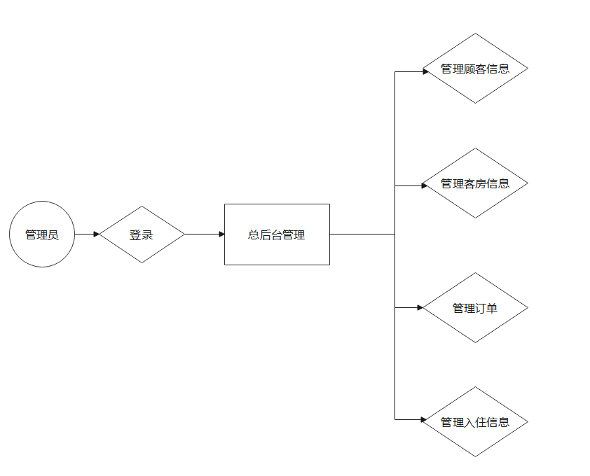

### 1.3 功能流程图

##### 1.3.1 管理顾客信息

###### 1. 增加顾客信息

顾客在发出订房请求时，首先录入该顾客信息，供后续增加订单使用。

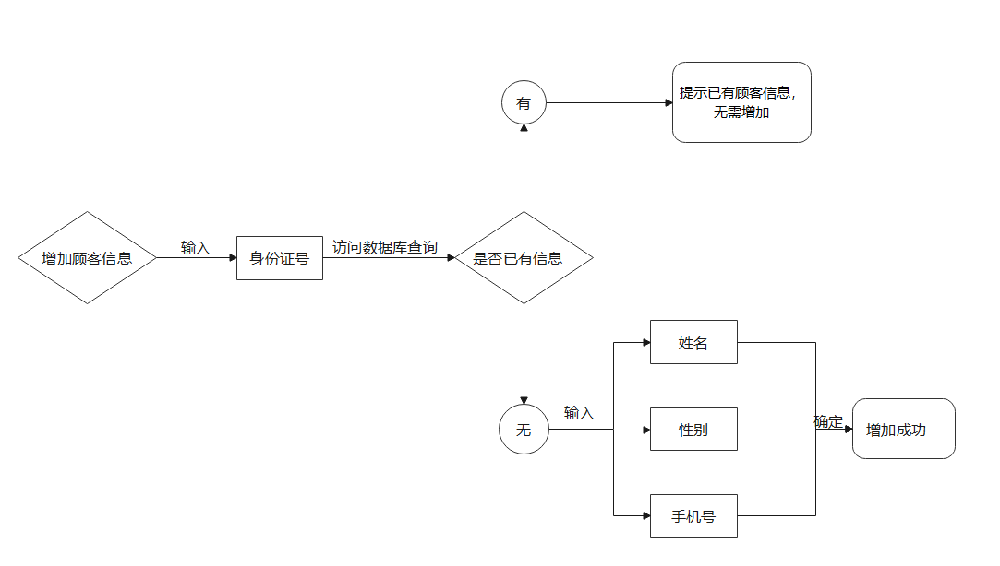

###### 2. 删除顾客信息

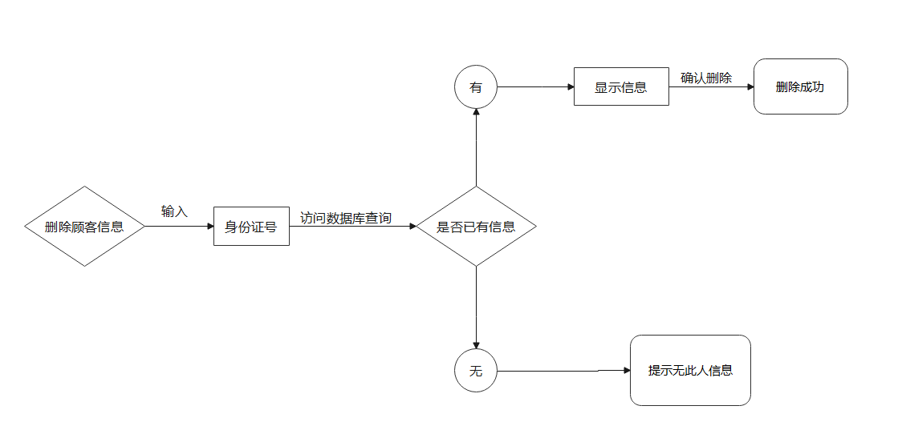

###### 3. 修改顾客信息

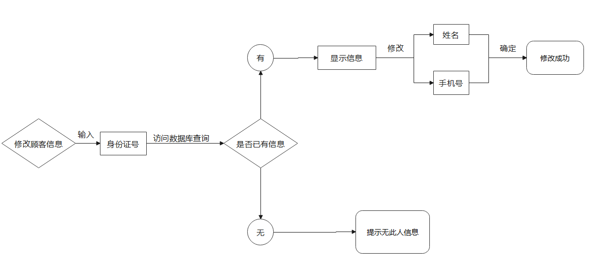

###### 4. 查询顾客信息

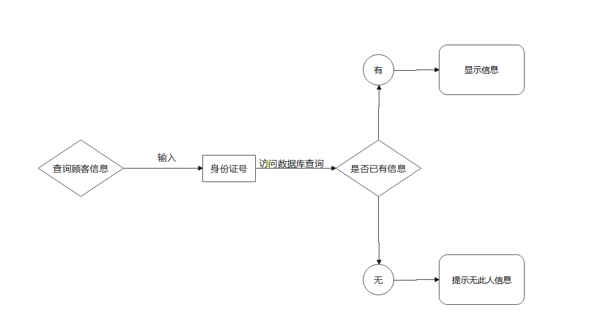

##### 1.3.2 管理客房信息

###### 1. 增加客房信息

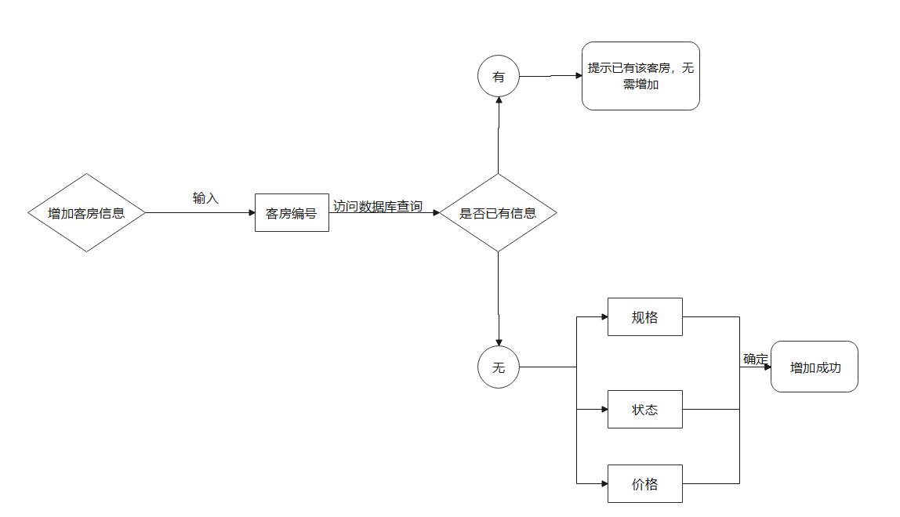

###### 2. 删除客房信息

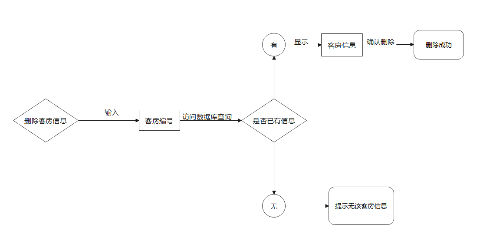

###### 3.修改客房信息

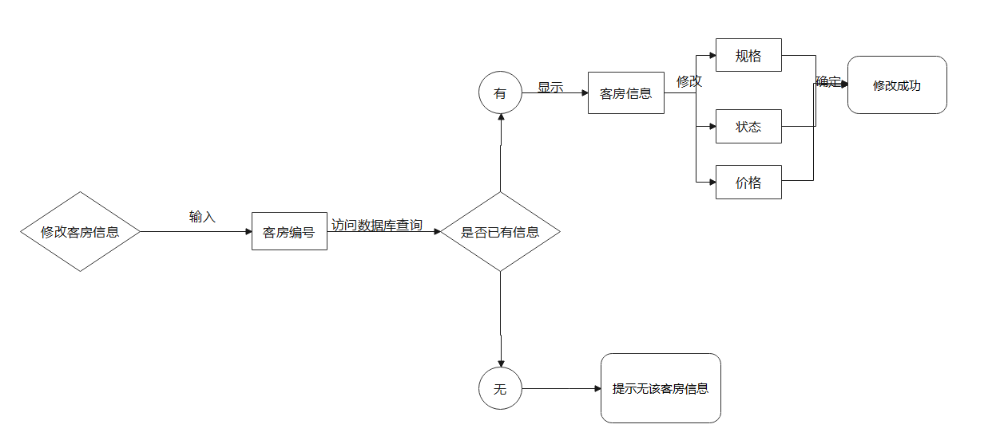

###### 4.查询客房信息

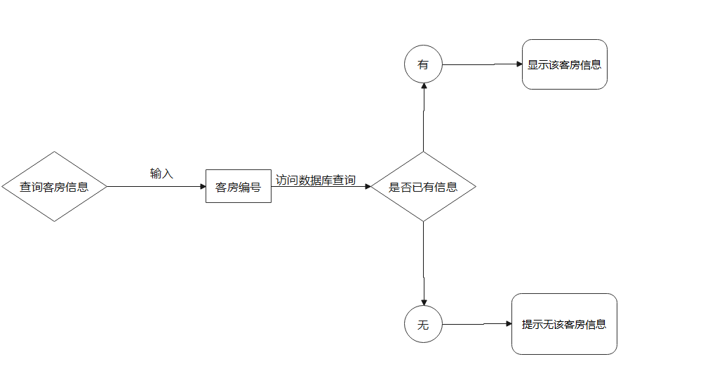

##### 1.3.3 管理订单

###### 1. 增加订单

一个订单对应一间客房。顾客支付后即增加订单。

订单编号自动生成；预定时间为支付时间；入住时间为顾客拟入住时间；入住人信息通过输入身份证号从数据库导入（可有多个入住人）；客房编号通过查询空闲的指定房型客房进行选择；支付金额为顾客支付的总金额。

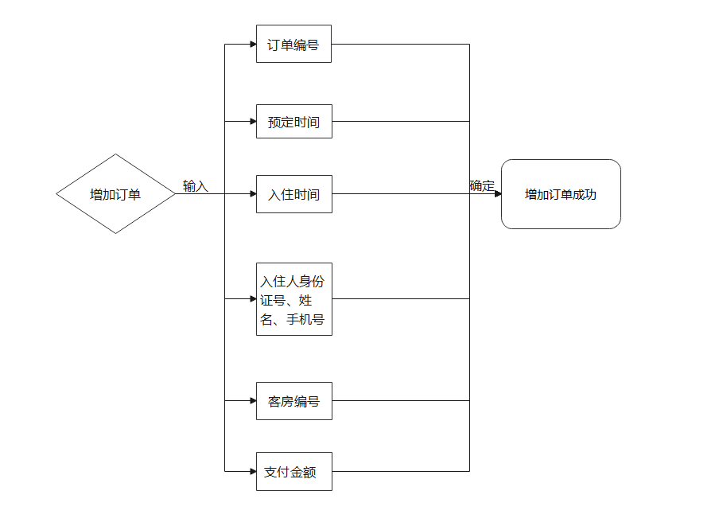

###### 2. 删除订单

通过输入订单编号/客房编号，查询订单，确认并删除。

###### 3. 修改订单

通过输入订单编号/客房编号，查询订单，修改指定信息。

###### 4. 查询订单

通过输入订单编号/客房编号，查询订单。

##### 1.3.4 管理入住信息

###### 1. 增加入住信息

一个入住信息对应一间客房。生成订单后，顾客入住时，增加入住信息。

入住信息编号自动生成；客房编号、入住人信息、入住日期与订单中信息保持一致；离店日期初始为空，待客户退房时填入；状态分为入住中、续住、已退房，初始为入住中。

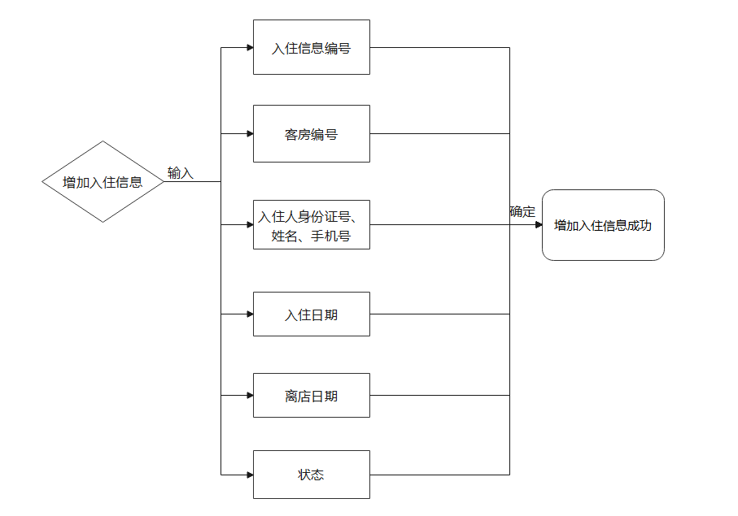

###### 2. 修改入住信息

通过输入入住信息编号/客房编号，查询入住信息，修改指定信息。

###### 3. 查询入住信息

通过输入入住信息编号/客房编号，查询入住信息。

# 2 数据库设计

### 2.1 表

##### 1. Customer

顾客信息表（身份证号、姓名、性别、手机号）

| 属性       | 数据类型    | 非空 | 主键 | 备注 |
| ---------- | ----------- | ---- | ---- | ---- |
| customerId | VARCHAR(30) | Y    | Y    |      |
| name       | VARCHAR(30) | Y    |      |      |
| sex        | CHAR(1)     | Y    |      | F，M |
| phoneNum   | int         | Y    |      |      |

##### 2. Room

客房信息表（客房编号、规格、状态、价格）

| 属性   | 数据类型    | 非空 | 主键 | 备注                 |
| ------ | ----------- | ---- | ---- | -------------------- |
| roomId | VARCHAR(30) | Y    | Y    |                      |
| size   | VARCHAR(30) | Y    |      | 单人间/双人间/豪华间 |
| state  | VARCHAR(30) | Y    |      | 维修/租用/空闲       |
| price  | int         | Y    |      | 100/200/300          |

##### 3. Order

订单信息表（订单编号、客房编号、预定时间、拟入住时间、入住人身份证号、支付金额）

| 属性        | 数据类型    | 非空 | 主键 | 备注                 |
| ----------- | ----------- | ---- | ---- | -------------------- |
| orderId     | VARCHAR(30) | Y    | Y    |                      |
| roomId      | VARCHAR(30) | Y    |      | 外键，参照Room表     |
| reserveDate | Date        | Y    |      | 生成订单的时间       |
| checkinDate | Date        | Y    |      | 拟入住时间           |
| customerId  | VARCHAR(30) | Y    |      | 外键，参照Customer表 |
| price       | Number(6,2) | Y    |      |                      |

##### 4. Checkin

入住信息表（入住信息编号、客房编号、入住人身份证号、入住日期、离店日期、状态）

| 属性        | 数据类型    | 非空 | 主键 | 备注                 |
| ----------- | ----------- | ---- | ---- | -------------------- |
| checkinId   | VARCHAR(30) | Y    | Y    |                      |
| roomId      | VARCHAR(30) | Y    |      | 外键，参照Room表     |
| customerId  | VARCHAR(30) | Y    |      | 外键，参照Customer表 |
| checkinDate | Date        | Y    |      | 真实入住时间         |
| leaveDate   | Date        |      |      |                      |
| state       | VARCHAR(30) | Y    |      | 入住中，续住，已退房 |

